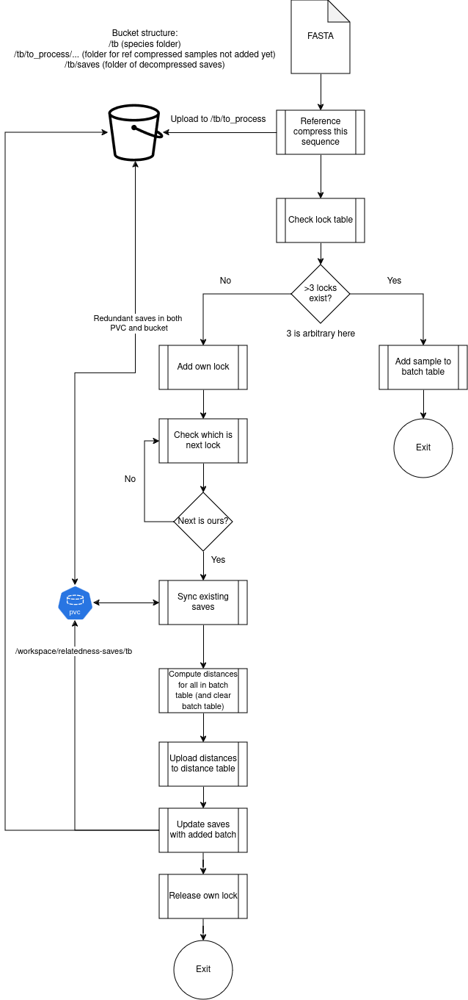

# fn6_pipeline
Nextflow wrapper for FN6. 

# Local
Given a directory of existing FN6 saves, compute additional new distances for given files.

```bash
nextflow run . -profile docker --local true --samples path/to/new/sample/fastas --existing_saves path/to/existing/fn6/saves --ref_fasta path/to/reference/fasta --mask path/to/exclusion/mask --cutoff 20 --publish_dir path/to/output/directory
```

# Development
> [!CAUTION]
> If you are not an MMM developer, you cannot run in this mode due to dependence on our API.

Enables auto-queuing and auto-batching of samples for performance gains.

## Running locally with docker
Requires an API to be running to handle database and bucket operations. Run `bash local_setup.sh` on first run to ensure the expected bucket structure exists.
```
sudo nextflow run . -profile docker -latest --api_url <api URL> --sample <fasta path>
```
Where:
* `<api URL>` is the URL for the API
* `<fasta path>` is the full (absolute) path to a sample's FASTA file

## Testing

Tests are run against the dev sp4 environment. As such, the poller's API key needs to be recovered from the environment before running anything. There is also a single sample setup with the correct permissions on sp4 dev which must be used - this can be found in the github variables
```bash
# Setup your local env with required directories
bash local_setup.sh
sudo bash test/test.sh "API_KEY_HERE" "SAMPLE_ID_HERE"
```

As this test suite (and the pipeline) rely on API calls for running, as well as retriving results, `nf-test` was inappropriate.

## Tags, Releases, and Committing
Use conventional commits. This is enforced with commitizen validate action and pre-commit hooks:
```bash
pre-commit install
```

This repo uses a standard gitflow approach, so changes should be first merged into develop and then released to main.
- In the develop branch semantic versioning is not used. Instead you can reference the commit hash to use it in a workflow.
- In a release branch you can create a release candidate with `cz bump a.b.c-rcX`. This also creates a tag.
- When release branch is ready for main run `cz bump a.b.c --files-only`. Manually write a human descriptive changelog. Then push these changes to main and make a release/tag there.

## Process


## Error handling
As we are using a distributed locking mechanism, it is important to ensure that the lock is released upon failure.
Nextflow does not support this kind of try/catch behaviour natively, so use of `trap` to catch errors within processing steps allows an error log to track all errors - skipping processes as appropriate. This also allows the overarching pipeline to figure out which step failed and report it as such.

## Adding a new species
To add a new species, there are a few things which need to be done to avoid (sometimes) non-descript errors.
1. Add a row to the species table `insert into species(species_name) values("<species name>");`
    * Without this, you'll get a 404 with a message `species not found!`
2. Add a folder to the relatedness bucket `mkdir -p <relatedness bucket>/<species name>` or use the cloud interface
    * Without this, you'll get a 404 with no message
3. Add a subfolder to the relatedness bucket `mkdir -p <relatedness bucket>/<species name>/to_process` or use the cloud interface
    * Without this, you'll get a 500 with no message
4. Add a subfolder to the relatedness bucket `mkdir -p <relatedness bucket>/<species name>/saves` or use the cloud interface
    * Without this, you'll get a 500 with no message
