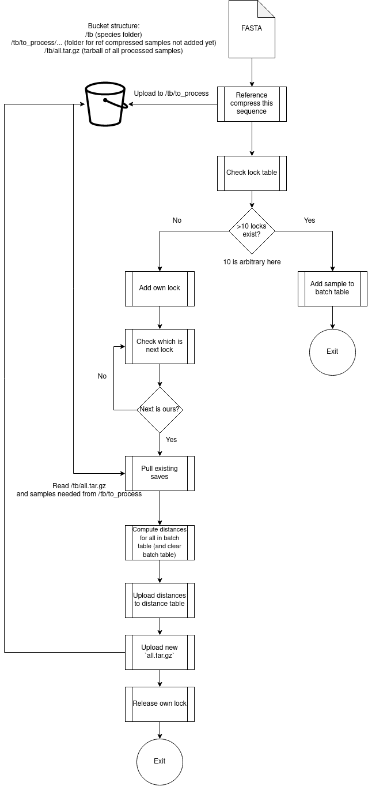

# fn5_pipeline
Nextflow wrapper for FN5. Enables auto-queuing and auto-batching of samples for performance gains.

## Running locally with docker
Requires an API to be running to handle database and bucket operations
```
sudo nextflow run . -profile docker -latest --api_url <api URL> --sample <fasta path>
```
Where:
* `<api URL>` is the URL for the API
* `<fasta path>` is the full (absolute) path to a sample's FASTA file  

## Deleting from buckets
As deleting from a bucket is not supported by a bucket PAR, to enable this, nextflow secrets must be added.

1. Setup OCI CLI locally - generating a config file and an API key. This assumes your oci config is at `~/.oci/config` and your key is `~/.oci/oci_api_key.pem`
2. Store these as nextflow secrets:
    ```
    nextflow secrets set OCI_CONFIG "$(cat ~/.oci/config | base64 -w 0)"
    nextflow secrets set OCI_KEY "$(cat ~/.oci/oci_api_key.pem | base64 -w 0)"
    ```

## Process


## GDPR data removal
To be GDPR compliant, we need to be able to delete user's saves upon request. This is currently not implemented, but the process would need to be something like:
1. Stop other processing. Probably through acquiring the lock, but could also be during planned downtime
2. Take a list of GUIDs to delete
3. Pull the saves tarball && decompress
4. Delete each of the GUIDS from the saves:
    ```
    for guid in to_delete;
    do
        rm saves/$guid*
    done
    ```
5. Recompress && upload
6. Release the lock (if applicable)


